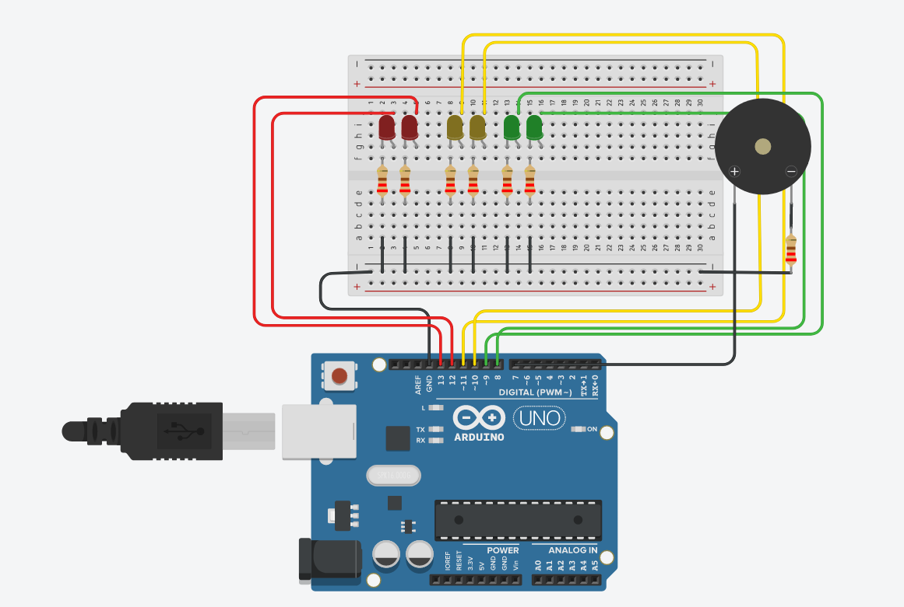

##** Documentación Dojos 1

## Integrantes 
- Martin Luque
- Nazareno Gonzalez
- Martin Luque
- Agustin Mondani
- Facundo Miño 

## Proyecto: DOJO.

## Consigna
El gobierno de la cuidad quiere actualizar los semáforos que tiene instalados. La empresa
“ScaraRobotics” gano la licitación y ahora les toca a los desarrolladores de la empresa generar
un proyecto low cost que cumpla con las especificaciones que el gobierno de la cuidad nos
impone, a saber las especificaciones son las siguientes.

1- El semáforo tiene que tener 2 leds de cada color como minimo, en caso de que uno se
rompa, lo ideal serian 3.

2- Tiene que implementar los tiempos correctos como se detallan a continuación.

3- El verde dura 45 segundos.

4- El amarillo dura 5 segundos.

5- Rojo dura 30 segundos.

6- Tiene que tener señalización para personas no videntes como se detalla a
continuación.

7- Durante el verde: No sonar

8- Durante el amarillo: Tiene que sonar 1 vez cada 2 segundos en un tono suave.

9- Durante el rojo: Tiene que sonar 1 vez por segundo en un tono fuerte.

## Codigo pricnipal
Esta codigo se encarga de encender y apagar los leds, y el sonido

LED_ROJO, LED_ROJO, LED_AMARILLO, LED_AMARILLO2, LED_VERDE, LED_VERDE2, SONIDO son #define que utilizamos para agregar los leds y el buzzer, asociandolo a pines de la placa arduino.

~~~ C (lenguaje en el que esta escrito)
void loop()
{
  digitalWrite(LED_ROJO, HIGH);
  digitalWrite(LED_ROJO2, HIGH);
  for (int i = 0;i<30;i++){
	tone(SONIDO,2000);
	delay(500);
    noTone(SONIDO);
	delay(500);
  }
  digitalWrite(LED_ROJO, LOW);
  digitalWrite(LED_ROJO2, LOW);

  digitalWrite(LED_AMARILLO, HIGH);
  digitalWrite(LED_AMARILLO2, HIGH);
    for (int i = 0;i<2;i++){
	tone(SONIDO,5000);
	delay(500);
    noTone(SONIDO);
	delay(1500);
  }
  digitalWrite(LED_AMARILLO, LOW);
  digitalWrite(LED_AMARILLO2, LOW);

  digitalWrite(LED_VERDE, HIGH);
  digitalWrite(LED_VERDE2, HIGH);
  delay(45000);
  digitalWrite(LED_VERDE, LOW);
  digitalWrite(LED_VERDE2, LOW);
	
  digitalWrite(LED_AMARILLO, HIGH);
  digitalWrite(LED_AMARILLO2, HIGH);
  delay(5000);
  digitalWrite(LED_AMARILLO, LOW);
  digitalWrite(LED_AMARILLO2, LOW);

}

~~~

## :robot: Link al proyecto
- [Link Tinkercad](https://www.tinkercad.com/things/3UB47iIs1Iu-funky-borwo-lahdi/editel?sharecode=VVW9Wf8ew58oqMX5lVovzLTdFrnXEZk0e0ResUwPpYg)
- [Link GDB](https://onlinegdb.com/sXxg-CL2o)
